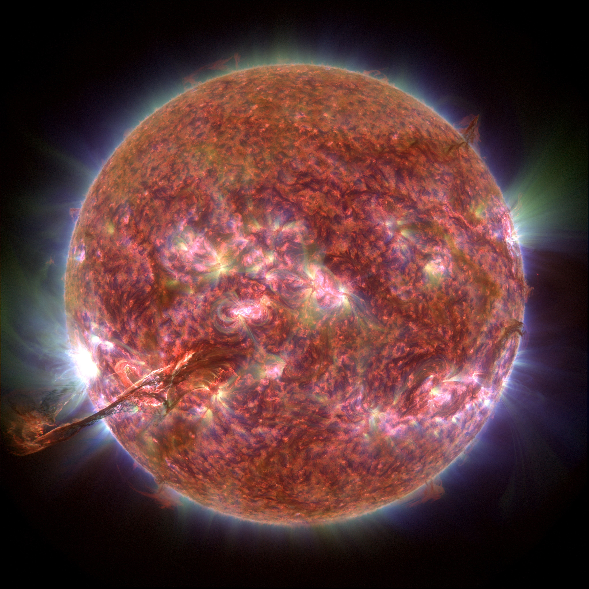

# aia-reloaded
We are a group of solar physicist working with the Solar Dynamics Observatory (SDO), a NASA mission. This project is a singular attempt at delivering a new view of our nearest star through the combination of advanced image processing methods with more awareness on how we, as humans and scientists, associate color with information on the Sun. 

This repository provides python scripts and functions to create calibrated and enhanced RGB image series and movies from the full resolution images of SDO/AIA at 3 different wavebands. 

[](https://youtu.be/TG8th-Skhx0)
See youtube video at https://youtu.be/TG8th-Skhx0


## Installation

Download and unpack files into an empty parent directory.

Main python dependencies:

* Python 3 (tested on 3.5 and above)
* numpy 
* astropy
* opencv (version 3.x.x)
* multiprocessing (optional, for parallel processing)
* [optional] pytest if you wish to run the unit tests. 

External dependencies:
* To fully automate the video creation from the rgb image series, you will need to install **ffmpeg**(https://www.ffmpeg.org)
 
If you wish to run the test functions with **pytest**: 

* create an **aia_data** directory in the parent directory

* Download the 3 test raw AIA fits files and place them into the **aia_data** directory:
  * [AIA 171](https://drive.google.com/open?id=1-qT9RFb8NXFWlhbvNVVXm52JJ0cjLJyV)
  * [AIA 193](https://drive.google.com/open?id=1NCVU91LQoFfmZMdg9eFec6nzdDf6q7Qx)
  * [AIA 304](https://drive.google.com/open?id=1lCoKH_BghuCuFwsrTVbtBz76ynVG_NQP)
  
* From the terminal, go into the project directory and run **pytest test/test_aia.py -v**

### How does it work? 

This framework assumes you know how to download the raw fits files from SDO/AIA. 
An example of the rgb image processing is given in **example_RGBMixer.py_**. It processes the raw fits files by rescaling each channel which correspond to one waveband. Our examples use the wavebands centered at 304 (red channel), 171 (green channel) and 193 Anstrom (blue channel).
To create movies, see examples in **aia_rgb_movies.py**. A full pipeline example is given in **script_full_pipeline.py**
The assignment of these wavebands to these colors is chosen in accordance to general human perception of colors. To that end, we are studying how to best make use of the CIE-based color spaces (e.g: CIELab, CIELuv, ...) which intend to implement as the frontend of the colorization instead of directly acting on the mixing between the RGB components. 

### Getting started

Example using the 3 samples from above. First create an "rgb" directory inside the "aia_data" directory that contains your 3 samples. This example will write an colored image with some default values. 

```python
import os, glob
from visualization import RGBMixer

## Create rgb image using the default aia rgb mixer.
# This example provides the data file paths and output directory

aia_mixer = RGBMixer(
    data_files = [glob.glob('../aia_data/*.%s*.fits'%wavel) for wavel in ['304', '171', '193']],
    outputdir = os.path.abspath('../aia_data/rgb/'))
aia_mixer.set_aia_default()

aia_mixer.process_rgb(0)
```

The above example processes only one image. If you want to process multiple rgb images from a list of raw fits files (e.g to create a movie), instead of ```aia_mixer.process_rgb(0)``` you would use ```aia_mixer.process_rgb_list(ncores, file_range)``` where e.g: ```file_range = range(200)``` to process images, and ```ncores = 4``` to parralelize over 4 workers. See e.g. **script_full_pipeline** for more examples.


